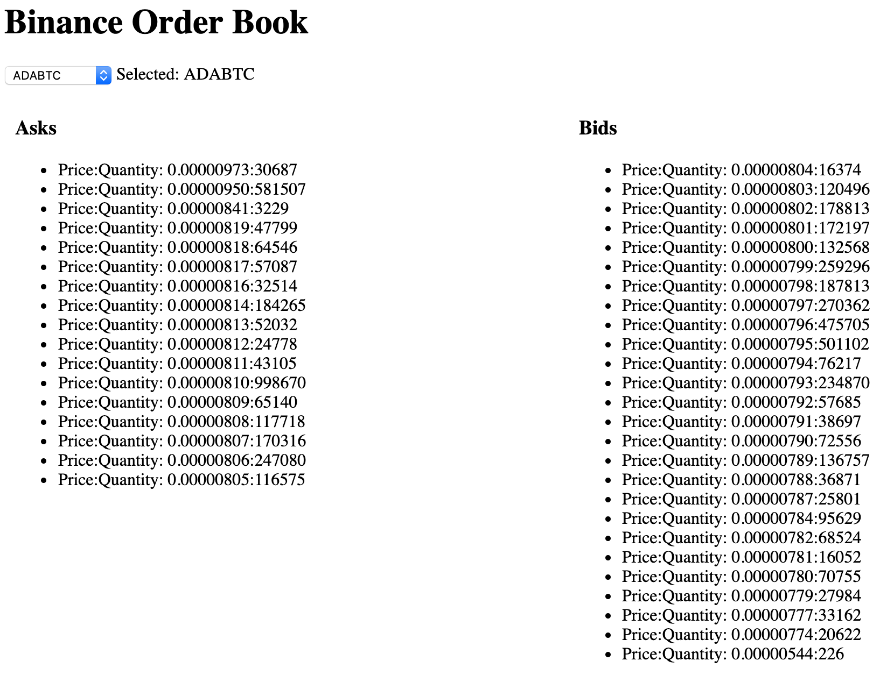

# Java-Binance-WebApp

## Overview
To get BIDs and ASKs order book
GET http://localhost:8090/api/v1/order-book

## Getting Started

These instructions will get you a copy of the project up and running on your local machine for development and testing purposes.

### Prerequisites

What things you need to install the software and how to install them

1. **InfluxDB**: [Install](https://docs.influxdata.com/influxdb/v1.7/introduction/installation/) Time series databse is required to store orderbook updates.
2. Run influxdb on port 8086 (default one)
3. Open CLI of influxdb by command `influxd -config /usr/local/etc/influxdb.conf`
4. Run these commands one by one:
    - ` CREATE USER sanjay WITH PASSWORD 'timeseries4days' WITH ALL PRIVILEGES`
    - `CREATE DATABASE mstakx`
    - `CREATE RETENTION POLICY "two_hours_mstakx" ON "mstakx" DURATION 2h REPLICATION 1 DEFAULT`
5. **JAVA 8**: [Install](https://www.oracle.com/technetwork/java/javase/overview/java8-2100321.html) It is requrired as application uses spring boot.

### Installing

#### Local Installation

1. Clone the repository via ssh/http.
2. Run this command 'mvn spring-boot:run' from root of the project

Hit `http:localhost:8090/` with all the API routes and go to the homepage.

You can now proceed to test the APIs using Postman or implement new features.